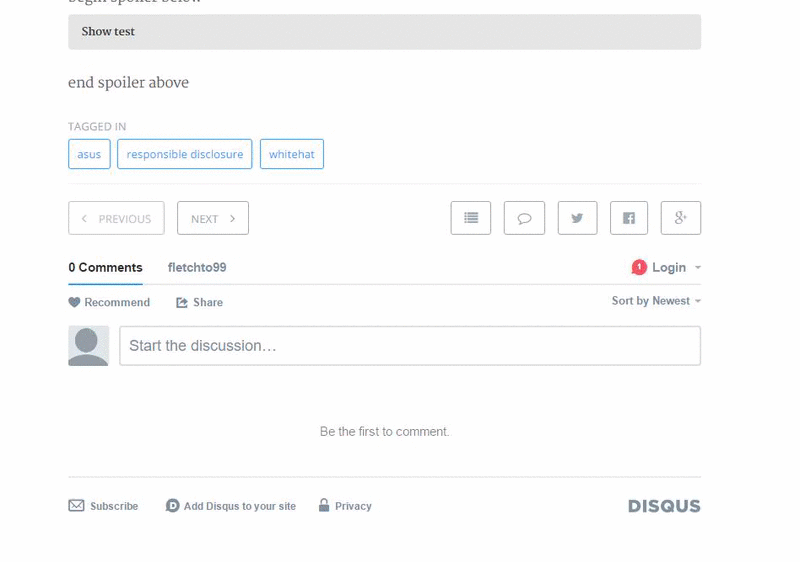

Inspired by [hexo-spoiler](https://github.com/unnamed42/hexo-spoiler)

## Install

```bash
npm install hexo-sliding-spoiler --save
```

If hexo can't detect this plugin automatically, you need to modify the `plugins` section of `[path_to_your_site]/_config.yml` manually, like:

```yaml
plugins:
 - hexo-sliding-spoiler
```

## Syntax

```plain

content

```

It will hide your text and place the title at the top with a dropdown/scroll up arrow.

## Demo



## Example

### One word title

```plain

content

```

### Title containing spaces


```plain

content

```
